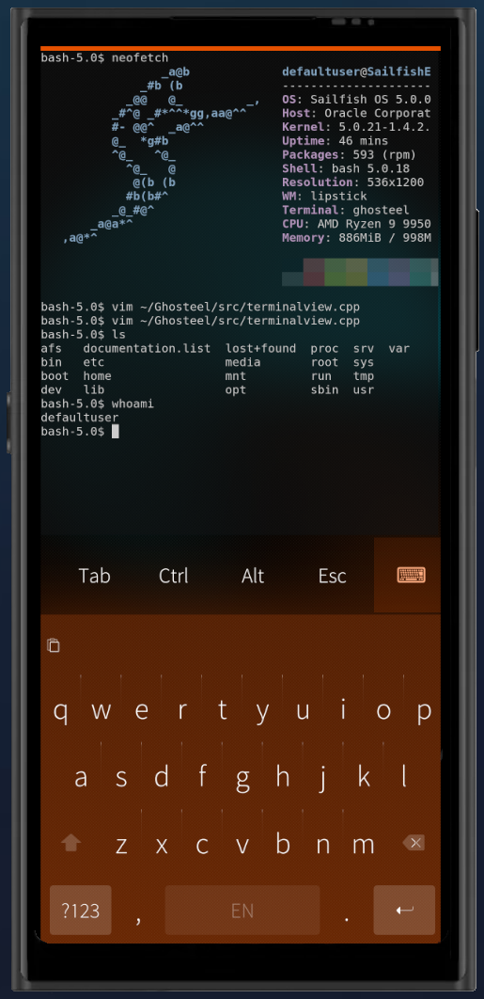
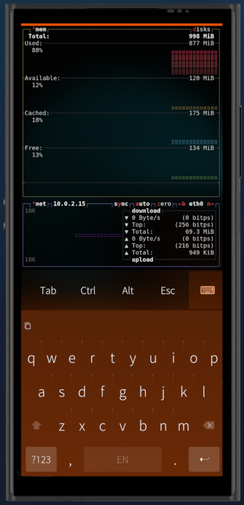
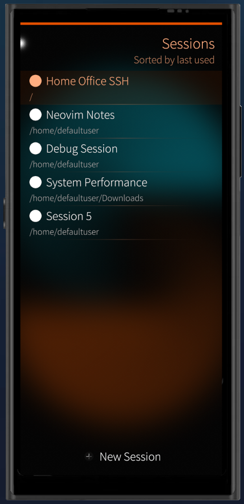

<p align="center">
  
</p>

<h1 align="center">Ghosteel</h1>

<p align="center"><strong>The <a href="https://github.com/ghostty-org/ghostty">Ghostty</a> terminal's VT engine, running on a Linux phone.</strong></p>

<p align="center"><sub>Built for <a href="https://sailfishos.org/">Sailfish OS</a> · Truecolor · GPU-rendered · Multi-session · Encrypted scrollback</sub></p>

<div align="center">

[](https://sailfishos-chum.github.io/apps/ghosteel/)

</div>

<div align="center">
  <table>
    <tr>
      <td align="center"></td>
      <td align="center"></td>
      <td align="center"></td>
    </tr>
    <tr>
      <td align="center"><sub>Truecolor &amp; GPU Rendering</sub></td>
      <td align="center"><sub>TUI App Support</sub></td>
      <td align="center"><sub>Multi-session</sub></td>
    </tr>
  </table>
</div>

Ghosteel is a Sailfish OS terminal built on [Ghostty](https://github.com/ghostty-org/ghostty)'s VT engine.
Most mobile terminals use older VT parsers that break on modern TUI apps. Using
Ghostty's parser means `tmux`, `neovim`, `htop`, `btop` and `lazygit` render
correctly, with truecolor and GPU rendering.

## Features

- **Ghostty VT engine**: full escape sequence support, 24-bit color, alternate screen buffer
- **GPU rendering**: OpenGL ES 2.0/3.0 renderer with cursor trails shader support
- **Multi-session**: create, name, switch, and persist sessions with per-session working directories
- **[Command Sessions](#desktop-file-launchers)**: launch commands in new sessions (`ghosteel -e htop`), switch to named sessions (`ghosteel -s editor`), create .desktop file launchers for TUI apps
- **Touch text selection**: long-press with Sailfish-style magnifier, velocity-aware hiding, double/triple tap
- **Pinch-to-zoom**: two-finger pinch to adjust font size with live overlay, per-session font size, optional (off by default)
- **Extra keys bar**: configurable sticky modifiers (Ctrl/Alt), arrow keys, F1-F12, PgUp/PgDn
- **Link detection**: OSC 8 hyperlinks and automatic URL detection, tap to open in browser
- **Inline images**: Kitty Graphics Protocol support, PNG decoding, configurable toggle
- **Encrypted scrollback**: Encryption backed by Sailfish Secrets, configurable retention (7–365 days or disabled)
- **2 color schemes**: Dark and Light, adjustable opacity
- **35+ translations**

## Install

**Recommended**: Install via [SailfishOS:Chum](https://sailfishos-chum.github.io/apps/ghosteel/):

```bash
devel-su pkcon install ghosteel
```

Also available from [OpenRepos](https://openrepos.net/content/zackslash/ghosteel-terminal) or [GitHub Releases](https://github.com/zackslash/Ghosteel/releases):

```bash
devel-su pkcon install-local ./ghosteel-<version>.rpm
```

### Desktop file launchers

Create `.desktop` files in `~/.local/share/applications/` to launch TUI apps directly into Ghosteel sessions:

```ini
[Desktop Entry]
Type=Application
X-Nemo-Application-Type=silica-qt5
X-Nemo-Single-Instance=no
Icon=ghosteel
Exec=ghosteel -e top
Name=Top

[X-Sailjail]
OrganizationName=com.zackslash
ApplicationName=ghosteel
Permissions=UserDirs;Secrets;
Sandboxing=Disabled
```

Use `-s <name>` to give the session a persistent name (survives app restart):

```ini
Exec=ghosteel -s sysmon -e top
```

Note: set `X-Nemo-Single-Instance` to `no`, otherwise the SailfishOS invoker swallows CLI args for already-running apps. If you edit a desktop file that's already on the homescreen, restart lipstick for the launcher to pick up changes:

```bash
systemctl --user restart lipstick.service
```

## Build

Requires Sailfish OS SDK and Zig 0.16.0.

```bash
# Install Zig 0.16.0
curl -L https://ziglang.org/download/0.16.0/zig-x86_64-linux-0.16.0.tar.xz | tar -xJ -C ~/.local/
ln -sf ~/.local/zig-x86_64-linux-0.16.0/zig ~/.local/bin/zig

# Build libghostty-vt for your target architecture
./scripts/build-libs.sh          # all architectures
./scripts/build-libs.sh aarch64  # single architecture

# Build RPM
mb2 build
```

## Architecture

Built with Qt/QML and Sailfish Silica. Terminal engine is Ghostty's `libghostty-vt` (Zig, static C library). Rendering via OpenGL ES. Supports Ghostty-compatible post-processing shaders on ES 3.0+. Native cover page, single-instance via QLocalSocket IPC. Built for aarch64, armv7hl, and i486.

## Development

### IDE Setup

Before first IDE build:

```bash
git submodule update --init
./scripts/build-libs.sh i486
```

See [CONTRIBUTING.md](CONTRIBUTING.md) for git hooks and development guidelines.

## License

MIT
